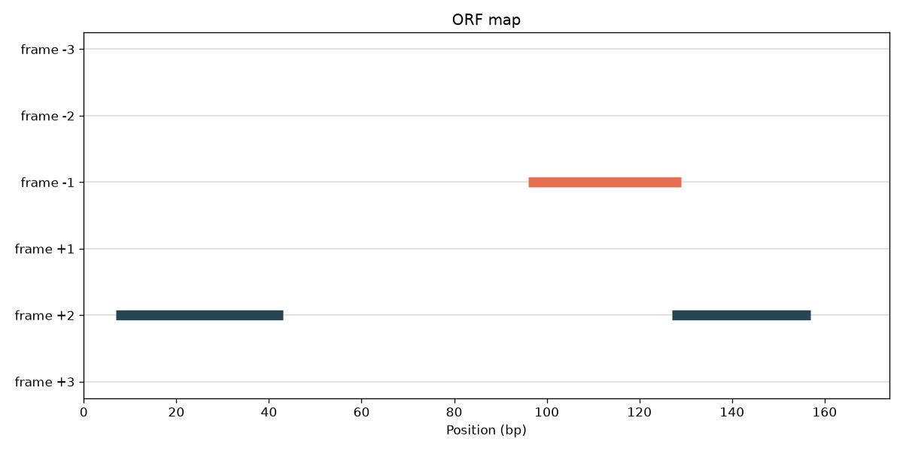

# GenomeSketch

**DNA sequence analysis toolkit for motifs, ORFs, mutations, and alignment.**

GenomeSketch is a lightweight, **fully offline** bioinformatics toolkit. It reads
DNA sequence files and analyzes them with algorithms written from scratch:
nucleotide statistics, motif search, reverse complement, transcription,
translation, open reading frame (ORF) detection, mutation comparison, global and
local sequence alignment, repeat detection, and plotting.

No internet. No cloud. No database. No Biopython for the core algorithms — every
piece of biology and math below is implemented in plain Python you can read.

**Stack:** Python, NumPy, Pandas, Matplotlib, Pytest, a `argparse` CLI, a custom
FASTA parser, and a from-scratch Needleman–Wunsch aligner.

> **Who is this README for?** Everyone. If you have never seen the letters
> `A T C G` before, start at **Part I** and read straight down — by the end you
> will understand both the biology *and* the algorithms well enough to explain
> them to someone else. If you just want to run commands, jump to
> [Part III — Install](#part-iii--installation) and
> [Part IV — Commands](#part-iv--command-reference).

---

## Table of contents

- [Part I — The biology, from zero](#part-i--the-biology-from-zero)
  - [1. What DNA actually is](#1-what-dna-actually-is)
  - [2. Two strands, and why direction matters](#2-two-strands-and-why-direction-matters)
  - [3. Complement and reverse complement](#3-complement-and-reverse-complement)
  - [4. GC content, AT content, and skew](#4-gc-content-at-content-and-skew)
  - [5. The Central Dogma: DNA → RNA → protein](#5-the-central-dogma-dna--rna--protein)
  - [6. Transcription](#6-transcription)
  - [7. Codons, the genetic code, and reading frames](#7-codons-the-genetic-code-and-reading-frames)
  - [8. Translation](#8-translation)
  - [9. Open reading frames (ORFs) and genes](#9-open-reading-frames-orfs-and-genes)
  - [10. Motifs](#10-motifs)
  - [11. Mutations](#11-mutations)
  - [12. Sequence alignment and homology](#12-sequence-alignment-and-homology)
  - [13. Repeats](#13-repeats)
- [Part II — The FASTA file format](#part-ii--the-fasta-file-format)
- [Part III — Installation](#part-iii--installation)
- [Part IV — Command reference](#part-iv--command-reference)
- [Part V — The math and algorithms in depth](#part-v--the-math-and-algorithms-in-depth)
- [Part VI — Coordinate conventions](#part-vi--coordinate-conventions)
- [Part VII — Project structure](#part-vii--project-structure)
- [Part VIII — Testing](#part-viii--testing)
- [Glossary](#glossary)
- [Limitations](#limitations)
- [Future work](#future-work)
- [License](#license)

---

# Part I — The biology, from zero

This part assumes **no background at all**. Read it once and the rest of the
tool will make sense.

## 1. What DNA actually is

Every living cell stores its instructions in a molecule called **DNA**
(deoxyribonucleic acid). Think of DNA as a very long piece of text written in an
alphabet of only **four letters**:

| Letter | Name     | Chemical class |
|:------:|----------|----------------|
| `A`    | Adenine  | purine         |
| `T`    | Thymine  | pyrimidine     |
| `C`    | Cytosine | pyrimidine     |
| `G`    | Guanine  | purine         |

Each letter is a **nucleotide** (also called a **base**). A DNA sequence is just
an ordered string of these bases, for example:

```
ATGCGTACCGTTAGCTAGCTAGGCTA
```

That string is the *entire* data type biology cares about at this level. A human
genome is the same idea, only ~3,200,000,000 letters long, split across 46
chromosomes. A **chromosome** is one very long DNA molecule; a **genome** is the
complete set of a organism's DNA; a **gene** is a stretch of DNA that encodes one
functional product (usually a protein).

A fifth symbol, **`N`**, is used in real data to mean *"a base is here, but we
don't know which one"* — for example where a sequencing machine couldn't read
confidently. GenomeSketch's default alphabet is therefore `A, T, C, G, N`.

> **IUPAC ambiguity codes.** Beyond `N`, biologists have single letters for
> *"this base is one of a specific subset"* — e.g. `R` = A or G, `Y` = C or T,
> `S` = G or C. These are the **IUPAC** codes. GenomeSketch supports them if you
> pass `--iupac`; otherwise only `A T C G N` are allowed so that typos are
> caught early.

## 2. Two strands, and why direction matters

DNA is **double-stranded**: two of these letter-strings run alongside each other
and physically pair up like a zipper (the famous double helix). The pairing rule
is strict and is the single most important fact in all of DNA analysis:

```
A always pairs with T
C always pairs with G
```

These are called **complementary base pairs** (A–T are held together by 2
hydrogen bonds, G–C by 3, which is why G+C-rich DNA is more stable — remember
this, it comes back in "GC content").

Each strand also has a **direction**. Chemically the backbone has two different
ends, named **5′** ("five prime") and **3′** ("three prime"). By universal
convention we **write sequences in the 5′ → 3′ direction, left to right.**

The two strands are **antiparallel** — they point in opposite directions. So if
the top strand reads 5′→3′ left-to-right, the bottom strand reads 5′→3′
right-to-left:

```
5'-A T G C C G-3'     (top strand, written left→right)
   | | | | | |
3'-T A C G G C-5'     (bottom strand, physically paired base-by-base)
```

The bottom strand, written the *normal* way (5′→3′, left to right), is
`CGGCAT`. Hold that thought — that operation is the **reverse complement**.

## 3. Complement and reverse complement

Two related operations:

- **Complement**: replace each base with its partner, *keeping the order*.
  `A→T, T→A, C→G, G→C, N→N`.
  `ATGCCG` → `TACGGC`.
- **Reverse complement**: take the complement **and then reverse it**. This
  gives you the *other strand read the normal way*.
  `ATGCCG` → complement `TACGGC` → reverse → `CGGCAT`.

Why does the reverse complement matter so much? Because genes can live on
**either strand**. A gene on the bottom strand looks like nonsense if you only
read the top strand — you have to reverse-complement to see it. Every serious DNA
tool (including this one) searches both strands, and that is done with reverse
complement.

```bash
genomesketch revcomp examples/sample.fasta
```

## 4. GC content, AT content, and skew

Because G–C pairs have 3 hydrogen bonds and A–T pairs have only 2, the fraction
of a sequence that is G or C — its **GC content** — is a meaningful biological
number. High-GC DNA melts at higher temperatures and is more stable; different
organisms and different genome regions have characteristic GC content. GC content
also helps locate genes, design lab primers, and classify organisms.

- **GC content** = `(G + C) / (A + T + G + C)` — fraction of strong (3-bond) pairs.
- **AT content** = `(A + T) / (A + T + G + C)` — the rest (they sum to 1).

**Skew** measures an *imbalance between a base and its complement on one strand*.
Because of how DNA is copied, the leading and lagging strands accumulate
different numbers of G vs C. Plotting **GC skew** along a bacterial genome
produces a characteristic switch of sign at the origin and terminus of
replication — a real, used-in-practice signal.

- **GC skew** = `(G − C) / (G + C)`
- **AT skew** = `(A − T) / (A + T)`

Skew ranges from −1 to +1. A value near 0 means the two bases are balanced;
positive means the numerator base dominates. (All four formulas guard against
division by zero — an empty or all-`N` sequence returns `0.0` instead of
crashing.)

```bash
genomesketch stats examples/sample.fasta
```

## 5. The Central Dogma: DNA → RNA → protein

The **Central Dogma** of molecular biology describes how the instructions in DNA
become working machines:

```
   DNA  ──transcription──▶  RNA  ──translation──▶  Protein
 (storage)                (messenger)            (does the work)
```

1. **DNA** is the archived master copy.
2. A gene is **transcribed** into a working copy made of **RNA**.
3. The RNA is **translated** into a **protein** — a chain of amino acids that
   folds into a molecular machine (an enzyme, a structural fiber, a signal, …).

GenomeSketch implements steps 2 and 3 exactly.

## 6. Transcription

**RNA** (ribonucleic acid) is chemically almost identical to DNA, with one
alphabet change: RNA uses **Uracil (`U`)** wherever DNA would use Thymine (`T`).
So transcription of a coding strand is, at the letter level, just:

```
T → U     (A, C, G unchanged)
```

`ATGCGT` (DNA) → `AUGCGU` (RNA).

```bash
genomesketch transcribe examples/sample.fasta
```

## 7. Codons, the genetic code, and reading frames

Proteins are chains of **amino acids** (20 common ones). The cell reads the
RNA/DNA **three letters at a time**; each triplet is a **codon**, and each codon
specifies one amino acid — or a "stop" instruction.

Three letters, four possible letters each → 4³ = **64 possible codons**. The
mapping from the 64 codons to the 20 amino acids (plus stop) is called the
**genetic code**, and it is (almost) universal across all life. GenomeSketch uses
the **NCBI standard genetic code (table 1)**, typed out by hand in
[`translate.py`](genomesketch/translate.py).

Amino acids are written as **single letters** (`M` = Methionine, `F` =
Phenylalanine, `E` = Glutamate, …). Two special outputs:

- **`*`** marks a **stop codon** (`TAA`, `TAG`, `TGA`) — "end of protein."
- **`X`** marks a codon we cannot resolve (contains `N` or another unknown base).

Because the reading is in triplets, **where you start matters.** The same
sequence read starting at position 0, 1, or 2 gives three completely different
protein readings. These are the three **reading frames** on one strand:

```
Sequence:   A T G G A A T T T T A A
Frame 1 →   ATG GAA TTT TAA          →  M  E  F  *
Frame 2 →   A TGG AAT TTT AA         →     W  N  F   (leftover "AA" ignored)
Frame 3 →   AT GGA ATT TTA A         →     G  I  L   (leftover "A" ignored)
```

Add the reverse complement strand and you get three more frames, numbered
`-1, -2, -3`. **Six frames total** — that is why ORF finders scan all six.
Any leftover 1–2 bases at the end that don't complete a codon are ignored.

## 8. Translation

**Translation** turns a nucleotide sequence into a protein by looking up each
codon in the genetic code:

```
ATG GAA TTT TAA
 M   E   F   *
```

`ATG` is special: it codes for Methionine **and** is the usual **start codon**
that tells the ribosome "begin the protein here."

```bash
genomesketch translate examples/sample.fasta --frame 1
genomesketch translate examples/sample.fasta --frame -1   # reverse strand
```

## 9. Open reading frames (ORFs) and genes

An **Open Reading Frame** is a stretch that *could* encode a protein: it begins
with a start codon `ATG` and runs, codon by codon **in the same frame**, until it
hits a stop codon (`TAA`, `TAG`, `TGA`). Everything in between translates to a
candidate protein.

```
... A A A ATG AAA TAA C C C ...
        └───ORF────┘
        start        stop
        ATG AAA TAA  →  protein  M K  (the stop * is not part of the protein)
```

Finding ORFs is the first step in **gene prediction** — long ORFs are strong
candidates for real protein-coding genes, because random DNA rarely goes far
without hitting a stop codon by chance.

GenomeSketch scans **all six frames**, reports each ORF's frame, start, stop,
length, and translated protein, and can filter by minimum length or keep only the
single longest ORF.

```bash
genomesketch orfs examples/sample.fasta --min-length 30
genomesketch orfs examples/sample.fasta --longest
```

## 10. Motifs

A **motif** is a short pattern of bases with biological meaning — a
transcription-factor binding site, a restriction-enzyme cut site (e.g. `GAATTC`
for EcoRI), a start codon `ATG`, a `TATA` box, and so on. "Motif search" is
simply: *find every place this short pattern occurs.*

Two subtleties GenomeSketch handles that a naive search misses:

- **Overlapping matches.** In `AAAAA`, the motif `AAA` occurs at positions
  `0, 1, 2` — the occurrences overlap. A search that jumps past each match would
  wrongly report only one.
- **Both strands.** With `--revcomp`, GenomeSketch also finds the motif on the
  opposite strand (by searching for the motif's reverse complement), because a
  binding site can be on either strand.

```bash
genomesketch motif examples/sample.fasta --motif ATG
genomesketch motif examples/sample.fasta --motif GAATTC --revcomp
```

## 11. Mutations

A **mutation** is a difference between two sequences (say a reference genome and a
sequenced patient sample). The basic kinds:

- **Substitution (SNP):** one base swapped for another. `...A...` → `...G...`.
- **Insertion:** one or more extra bases appear. `ATGCGT` → `ATG`**`A`**`CGT`.
- **Deletion:** one or more bases are removed. `ATGACGT` → `ATG_CGT`.

**Percent identity** is the headline summary: what fraction of positions match.

If two sequences are the **same length**, you can compare them position by
position (only substitutions are possible). If they differ in length — or you
pass `--align` — GenomeSketch first **aligns** them (next section) and then reads
off substitutions, insertions, and deletions from the alignment.

```bash
genomesketch compare examples/reference.fasta examples/mutated.fasta
genomesketch compare examples/reference.fasta examples/mutated.fasta --align
```

## 12. Sequence alignment and homology

Two related sequences may have drifted apart through mutations. To compare them
fairly you must first line them up, inserting **gaps** (`-`) so that matching
regions sit in the same columns. That is **sequence alignment**:

```
seq1:  ATG-CGT
seq2:  ATGACGT
       ||| |||        (| = match, gap where seq1 has "-")
```

Alignment reveals **homology** (shared ancestry), pinpoints exactly which bases
changed, and underlies almost everything in comparative genomics. The classic
algorithm for aligning two whole sequences end-to-end is **Needleman–Wunsch**
(global alignment); the variant that finds the best-matching *sub-region* is
**Smith–Waterman** (local alignment). GenomeSketch implements both from scratch
with dynamic programming — the full math is in
[Part V](#part-v--the-math-and-algorithms-in-depth).

```bash
genomesketch align examples/reference.fasta examples/mutated.fasta
genomesketch align examples/reference.fasta examples/mutated.fasta --local
```

## 13. Repeats

Genomes are full of **repeated sequences**. **Tandem repeats** are copies sitting
directly next to each other — `ATGATGATG` is the motif `ATG` repeated 3× back to
back. Short tandem repeats (microsatellites) are used in DNA fingerprinting and
are involved in several genetic diseases when they expand. Dispersed repeats
(same k-mer appearing in many places) matter for genome assembly and evolution.

GenomeSketch counts repeated **k-mers** (substrings of length *k*) and can isolate
**tandem** arrays specifically.

```bash
genomesketch repeats examples/sample.fasta --k 3 --min-count 3
genomesketch repeats examples/sample.fasta --k 3 --min-count 3 --tandem
```

---

# Part II — The FASTA file format

Nearly all sequence data ships as **FASTA**. The format is deliberately trivial:

```
>identifier optional free-text description
SEQUENCE LINE 1
SEQUENCE LINE 2
...
>next_identifier ...
...
```

Rules GenomeSketch follows (implemented in [`io.py`](genomesketch/io.py)):

- A line starting with **`>`** is a **header**. The first whitespace-separated
  token after `>` is the **id**; everything after it is the **description**.
- All following lines until the next `>` are the **sequence**, concatenated
  together. Sequences may span **many lines** (historically wrapped at 60–80
  characters per line — you'll see this in `examples/sample.fasta`).
- **Blank lines and surrounding whitespace are ignored.**
- A file may contain **many records** (multi-FASTA).
- A plain text file with **no `>` header at all** is treated as one anonymous
  sequence with id `sequence_1`.

A minimal record and how GenomeSketch models it:

```
>sample_1 example sequence
ATGCGTACCGTTAGCTAGCTAGGCTA
```

```python
SequenceRecord(
    id="sample_1",
    description="example sequence",
    sequence="ATGCGTACCGTTAGCTAGCTAGGCTA",
)
```

Common extensions — `.fasta`, `.fa`, `.fna` — are all just FASTA text and all
work. GenomeSketch **validates** every sequence on load: it upper-cases it,
strips whitespace, and rejects any character outside `A T C G N` (unless
`--iupac`), reporting the exact position of the first offenders so you can fix
your file.

---

# Part III — Installation

GenomeSketch requires **Python 3.11 or newer**. Check yours:

```bash
python3 --version
```

### Step-by-step

```bash
# 1. Get the code
git clone https://github.com/kingsleychenlab/GenomeSketch.git
cd GenomeSketch

# 2. Create an isolated environment (keeps these packages off your system Python)
python3 -m venv .venv

# 3. Activate it
source .venv/bin/activate          # macOS / Linux
#    .venv\Scripts\activate         # Windows PowerShell

# 4. Install the dependencies (NumPy, Pandas, Matplotlib, Pytest)
pip install -r requirements.txt

# 5. (Optional) install GenomeSketch itself so the `genomesketch` command exists
pip install -e .
```

### Two equivalent ways to run

| You installed with `pip install -e .` | You did not |
|---------------------------------------|-------------|
| `genomesketch stats examples/sample.fasta` | `python -m genomesketch.cli stats examples/sample.fasta` |

Both do exactly the same thing. **This README uses the short `genomesketch`
form.** If you didn't run step 5, mentally replace `genomesketch` with
`python -m genomesketch.cli`.

When you're done, `deactivate` leaves the virtual environment.

### Sanity check

```bash
genomesketch --version          # -> GenomeSketch 0.1.0
python -m pytest                # -> 94 passed
genomesketch stats examples/sample.fasta
```

---

# Part IV — Command reference

Every command takes a FASTA/plain-text file. Commands that work on a single
sequence but receive a multi-sequence file will process **each** record (or, for
pairwise/plot commands, use the **first** record and tell you). Add `--iupac` to
any command to permit the full IUPAC alphabet. Use `genomesketch <command>
--help` for the built-in help.

All position outputs are **0-based** (see
[Part VI](#part-vi--coordinate-conventions)).

---

### `stats` — nucleotide composition

```bash
genomesketch stats examples/sample.fasta
```

```text
Sequence: sample_1
Length: 174 bp
A: 37
T: 35
C: 43
G: 59
N: 0
GC content: 58.62%
AT content: 41.38%
GC skew: 0.157
AT skew: 0.028
```

Reports length, per-base counts, GC/AT content and GC/AT skew for every sequence
in the file.

---

### `motif` — exact, overlapping motif search

```bash
genomesketch motif examples/sample.fasta --motif ATG
```

```text
Sequence: sample_1
Motif: ATG  (matches: 6)
  pos 7-10  strand +  ATG
  pos 22-25  strand +  ATG
  pos 52-55  strand +  ATG
  pos 73-76  strand +  ATG
  pos 127-130  strand +  ATG
  pos 153-156  strand +  ATG
```

| Flag | Meaning |
|------|---------|
| `--motif TEXT` | (required) the pattern to search for |
| `--revcomp`    | also report reverse-complement hits, shown on the `-` strand |

Positions are printed as `start-end` (0-based, half-open), so `7-10` is a
3-base motif covering indices 7, 8, 9.

---

### `revcomp` — reverse complement

```bash
genomesketch revcomp examples/sample.fasta
```

Emits FASTA-style output; `ATGCCG` → `CGGCAT`.

---

### `transcribe` — DNA → RNA

```bash
genomesketch transcribe examples/sample.fasta
```

Replaces every `T` with `U`; `ATGCGT` → `AUGCGU`.

---

### `translate` — DNA/RNA → protein

```bash
genomesketch translate examples/sample.fasta --frame 1
```

| Flag | Meaning |
|------|---------|
| `--frame {1,2,3,-1,-2,-3}` | reading frame (default `1`). Negative frames read the reverse-complement strand. |

`ATGGAATTTTAA` → `MEF*`. Stops are `*`, unknown codons are `X`, and a trailing
partial codon is dropped.

---

### `orfs` — open reading frame detection (6 frames)

```bash
genomesketch orfs examples/sample.fasta --min-length 30
```

```text
Sequence: sample_1  (ORFs found: 3)

ORF 1
Frame: +2
Start: 7
Stop: 43
Length: 36 bp
Protein: MTVSGMGLVRS
...
```

| Flag | Meaning |
|------|---------|
| `--min-length N` | discard ORFs shorter than `N` base pairs (default `0`) |
| `--longest`      | report only the single longest ORF across all frames |

`Start`/`Stop` are 0-based half-open on the forward strand; `Length = Stop −
Start` **includes** the stop codon; `Protein` **excludes** it.

---

### `compare` — mutation comparison

```bash
genomesketch compare examples/reference.fasta examples/mutated.fasta
```

```text
Reference: reference (60 bp)
Mutated:   mutated (60 bp)
Mode: equal-length
Percent identity: 96.7%
Substitutions: 2
  Substitution at position 11: T -> A
  Substitution at position 36: T -> G
```

Equal-length inputs use a fast position-by-position scan (substitutions only).
Add `--align`, or give unequal-length inputs, to switch to alignment-based
comparison that also reports insertions and deletions:

```text
Mode: aligned
Percent identity: 85.7%
Substitutions: 0  Insertions: 1  Deletions: 0
  Insertion at position 3: +A
```

---

### `align` — pairwise alignment

```bash
genomesketch align examples/reference.fasta examples/mutated.fasta
```

```text
Algorithm: Needleman-Wunsch (global)
Score: 56
Identity: 96.7%
Matches: 58  Mismatches: 2  Gaps: 0

reference  ATGCGTACCGTTAGCTAGCTAGGCTAAGGCATGAAATTTGGGCCCTAAGGCACCTGTAGC
           |||||||||||.||||||||||||||||||||||||.|||||||||||||||||||||||
mutated    ATGCGTACCGTAAGCTAGCTAGGCTAAGGCATGAAAGTTGGGCCCTAAGGCACCTGTAGC
```

| Flag | Meaning |
|------|---------|
| `--local` | use Smith–Waterman local alignment instead of global |
| `--match N` | score for a matching column (default `+1`) |
| `--mismatch N` | score for a mismatching column (default `-1`) |
| `--gap N` | penalty per gap column (default `-2`) |

In the middle "match line", `|` = match, `.` = mismatch, space = gap.

---

### `repeats` — repeated k-mers and tandem repeats

```bash
genomesketch repeats examples/sample.fasta --k 3 --min-count 3
```

| Flag | Meaning |
|------|---------|
| `--k N` | k-mer length (default `3`) |
| `--min-count N` | only report k-mers occurring at least `N` times (default `2`) |
| `--tandem` | report only *adjacent* (tandem) repeat arrays |

For the tiny sequence `ATGATGATGCC` with `--k 3 --min-count 3`:

```text
Sequence: r
Repeats (k=3, min-count=3): 1
  ATG  copies 3  region 0-9  positions [0, 3, 6]
```

Each line reads: the k-mer, its copy count, the region it spans (`start-end`,
0-based half-open), and every start position.

---

### `kmers` — k-mer frequency table

```bash
genomesketch kmers examples/sample.fasta --k 3 --top 5
```

```text
Sequence: sample_1  (unique 3-mers: 44)
  AGC	11
  GCG	11
  GGC	11
  CTA	10
  GCA	9
```

| Flag | Meaning |
|------|---------|
| `--k N` | k-mer length (default `3`) |
| `--top N` | show the `N` most frequent k-mers (default `20`) |

---

### Plotting commands

All plotting commands render a **real Matplotlib figure** to a local file (no
network, headless `Agg` backend). Pre-rendered examples are in
[`examples/plots/`](examples/plots/).

```bash
genomesketch plot-gc    examples/sample.fasta --window 10 --step 2 -o gc.png
genomesketch plot-bases examples/sample.fasta -o bases.png
genomesketch plot-orfs  examples/sample.fasta --min-length 30 -o orf_map.png
genomesketch plot-motif examples/sample.fasta --motif ATG --revcomp -o motif_map.png
```

| Command | What it draws | Key flags |
|---------|---------------|-----------|
| `plot-gc` | GC% along the sequence in a sliding window | `--window`, `--step`, `-o` |
| `plot-bases` | bar chart of A/T/C/G/N counts | `-o` |
| `plot-orfs` | ORFs laid out on their six frame tracks | `--min-length`, `-o` |
| `plot-motif` | motif hit positions on both strands | `--motif`, `--revcomp`, `-o` |




---

# Part V — The math and algorithms in depth

This part explains **how** each result is computed. Everything here is
implemented in plain Python in the [`genomesketch/`](genomesketch/) package — no
external algorithm libraries.

## Composition statistics

Let a sequence have base counts `A, T, C, G` (ignoring `N`). Then:

```
GC content = (G + C) / (A + T + G + C)
AT content = (A + T) / (A + T + G + C)      note:  GC + AT = 1
GC skew    = (G − C) / (G + C)              range: −1 … +1
AT skew    = (A − T) / (A + T)              range: −1 … +1
```

**Worked example** for `ATGC` (A=1, T=1, G=1, C=1):
`GC = (1+1)/4 = 0.5`, `AT = 0.5`, `GC skew = (1−1)/2 = 0`, `AT skew = 0`.

Every denominator is checked; if it is `0` (empty sequence, or all `N`), the
function returns `0.0` instead of raising. `N` is deliberately excluded from the
content denominators because it is not a known base.

**Sliding-window GC** (`plot-gc`) slides a window of size `W` across the sequence
in steps of `S`, reporting GC content of each window at its start position. This
turns a single number into a *curve* that reveals GC-rich and GC-poor regions
(candidate genes, isochores, replication origins).

## Reverse complement

A single dictionary maps each base to its partner (`A↔T`, `C↔G`, `N→N`, plus the
IUPAC pairs). **Complement** applies the map in place; **reverse complement**
applies it and reverses the string. `O(n)` time.

## Translation and the codon table

The genetic code is stored as a 64-entry dictionary from DNA codon → amino-acid
letter (NCBI table 1). Translation:

1. Normalize (upper-case, `U`→`T`).
2. If the frame is negative, reverse-complement the sequence.
3. Skip `|frame| − 1` leading bases.
4. Walk the rest in non-overlapping triplets; look each up (`*` for stop, `X`
   for any codon containing an unknown base); stop early at the first `*` if
   `to_stop` is requested.
5. Ignore a trailing 1–2 base remainder.

## Motif search (overlapping)

Naive substring search that advances the start index by **one** after each hit
(not by the motif length), which is what makes overlapping matches appear:

```
find_motif("AAAAA", "AAA")  ->  [0, 1, 2]
```

With `--revcomp`, the same routine is run a second time on the motif's reverse
complement and those hits are labelled `-` strand. Complexity is `O(n·m)` worst
case (`n` = sequence length, `m` = motif length), which is plenty for typical
motifs; the code is intentionally simple and readable rather than using a
Knuth–Morris–Pratt automaton.

## ORF scanning

For each of three offsets (0, 1, 2) on both the forward strand and its reverse
complement:

1. Walk the strand in non-overlapping codons from the offset.
2. When not already inside an ORF and the codon is `ATG`, mark a start.
3. When inside an ORF and the codon is a stop (`TAA/TAG/TGA`), emit the ORF
   `[start, stop)` and its translated protein, then keep scanning.

Reverse-strand coordinates found on the reverse complement are mapped back to
forward-strand coordinates with `forward = len(seq) − rc_coord`. Filtering by
`--min-length` and selecting the `--longest` happen after collection.

## Needleman–Wunsch global alignment (in full)

This is the heart of the toolkit, so here is the **entire algorithm worked by
hand.** We align:

```
seq1 = ATGCGT
seq2 = ATGACGT
scoring:  match = +1,  mismatch = −1,  gap = −2
```

### Step 1 — build the scoring matrix `F`

`F` has one row per character of `seq1` (plus a leading row 0) and one column per
character of `seq2` (plus a leading column 0). The first row and column are the
cost of aligning against nothing but gaps (`0, −2, −4, −6, …`). Then each inner
cell is filled with the best of three choices:

```
F[i][j] = max(
    F[i-1][j-1] + s(seq1[i], seq2[j]),   # diagonal: align the two bases
    F[i-1][j]   + gap,                    # up:   seq1[i] against a gap
    F[i][j-1]   + gap                     # left: seq2[j] against a gap
)
```

where `s(x,y)` is `+1` if the bases match else `−1`. Filling it in completely:

```
          -     A     T     G     A     C     G     T
    -     0    -2    -4    -6    -8   -10   -12   -14
    A    -2     1    -1    -3    -5    -7    -9   -11
    T    -4    -1     2     0    -2    -4    -6    -8
    G    -6    -3     0     3     1    -1    -3    -5
    C    -8    -5    -2     1     2     2     0    -2
    G   -10    -7    -4    -1     0     1     3     1
    T   -12    -9    -6    -3    -2    -1     1     4
```

The bottom-right cell is the **optimal alignment score: 4.**

### Step 2 — traceback

Start at the bottom-right corner and walk back to the top-left, at each step
going to whichever neighbour produced the current cell's value:

- **diagonal** → emit `seq1[i]` over `seq2[j]` (a match or mismatch column),
- **up** → emit `seq1[i]` over a gap `-`,
- **left** → emit a gap `-` over `seq2[j]`.

Following the best path from `F[6][7]=4` back to `F[0][0]=0` produces (reading the
emitted columns back to front):

```
seq1:  A T G - C G T
seq2:  A T G A C G T
       | | |   | | |
```

Six matches and one gap: score = `6·(+1) + 1·(−2) = 4`. ✓ (This is exactly what
`genomesketch align` prints for these two sequences.)

### Cost

The matrix is `(n+1)·(m+1)`, so both time and memory are `O(n·m)`. This is why
alignment is meant for short-to-moderate sequences, not whole chromosomes.

### Identity and the match map

**Percent identity** = matches ÷ aligned columns × 100 = `6/7 ≈ 85.7%`. The
match line (`|` match, `.` mismatch, space gap) and the counts of
matches/mismatches/gaps come from a single pass over the two aligned strings.

## Smith–Waterman local alignment

Same dynamic program with two changes: (1) every cell is floored at `0`
(negative running scores reset, so the alignment can "start fresh" anywhere), and
(2) traceback begins at the **highest-scoring cell** and stops when it reaches a
`0`. The result is the best-matching *sub-region* rather than an end-to-end
alignment — ideal for finding a shared core inside otherwise different
sequences. Enable it with `align --local`.

## Mutation classification

Equal-length comparison is a zip over the two strings counting substitutions and
matches. Alignment-based comparison runs Needleman–Wunsch, then reads each
column: gap-in-reference → **insertion**, gap-in-alt → **deletion**, differing
bases → **substitution**, equal → match. Positions are reported in the
reference's own coordinate system.

## k-mers and repeats

A `k`-mer is any length-`k` substring. GenomeSketch builds a dictionary mapping
each observed k-mer to the (overlapping) list of positions where it starts, in a
single `O(n)` pass. **`find_repeats`** returns k-mers whose position list is at
least `min_count` long. **`find_tandem_repeats`** instead scans for a maximal run
where the same k-mer repeats with stride exactly `k` (i.e. copies sit directly
adjacent, like `ATG ATG ATG`).

---

# Part VI — Coordinate conventions

GenomeSketch uses **0-based, half-open** intervals everywhere, the same
convention as Python slicing, BED files, and most bioinformatics tooling.

- **0-based**: the first base is index `0`, not `1`.
- **Half-open `[start, stop)`**: `start` is included, `stop` is **not**. The
  length is simply `stop − start`.

So a motif reported as `pos 7-10` covers indices `7, 8, 9` (three bases), and an
ORF with `Start: 3`, `Stop: 12` is 9 bp long and you'd extract it in Python as
`sequence[3:12]`. For ORFs the interval **includes the stop codon**, while the
reported protein **excludes** it.

---

# Part VII — Project structure

```
GenomeSketch/
  genomesketch/
    __init__.py
    cli.py            # argparse command-line interface (all commands)
    io.py             # custom FASTA / plain-text parser, SequenceRecord
    validation.py     # alphabet validation & normalisation
    stats.py          # nucleotide composition, skew, GC windows
    motifs.py         # exact / overlapping / reverse-complement motif search
    transform.py      # complement, reverse complement, transcription
    translate.py      # standard genetic code + translation, 6 frames
    orfs.py           # six-frame ORF detection
    mutations.py      # substitution & indel comparison
    alignment.py      # Needleman-Wunsch + Smith-Waterman (from scratch)
    repeats.py        # k-mer & tandem repeat detection
    visualization.py  # Matplotlib plots
    export.py         # CSV / JSON export helpers
  tests/              # 94 pytest tests, one file per module
  examples/
    sample.fasta          # single sequence with embedded ORFs
    reference.fasta       # reference for compare/align
    mutated.fasta         # point-mutated copy of the reference
    multi_sequence.fasta  # multi-record FASTA (incl. N bases, GC-rich)
    plots/                # pre-rendered example figures
  README.md
  LICENSE               # MIT
  pyproject.toml        # packaging + `genomesketch` entry point
  requirements.txt
```

---

# Part VIII — Testing

```bash
python -m pytest            # 94 tests
python -m pytest -v         # verbose, per-test
python -m pytest tests/test_alignment.py   # one module
```

The suite covers FASTA parsing (single, multi, plain-text, malformed), invalid
nucleotide handling, GC content and skew, reverse complement, transcription,
translation and every reading frame, overlapping and reverse-complement motif
search, ORF finding, equal-length and alignment-based mutation comparison,
Needleman–Wunsch score **and** traceback reconstruction, Smith–Waterman, repeat
and tandem-repeat detection, plot-generation smoke tests (real non-empty PNGs),
and end-to-end CLI smoke tests.

---

# Glossary

| Term | Meaning |
|------|---------|
| **Base / nucleotide** | One letter of DNA: `A`, `T`, `C`, `G` (or `N` = unknown). |
| **bp** | "base pairs" — the unit of sequence length. |
| **Strand** | One of the two complementary DNA chains. Written 5′→3′. |
| **Complement** | Partner base: `A↔T`, `C↔G`. |
| **Reverse complement** | The opposite strand read 5′→3′. |
| **GC content** | Fraction of bases that are G or C. |
| **Skew** | Imbalance between a base and its complement on one strand. |
| **RNA** | Working copy of DNA; uses `U` instead of `T`. |
| **Transcription** | DNA → RNA (`T`→`U`). |
| **Codon** | A triplet of bases coding for one amino acid. |
| **Reading frame** | One of 3 offsets (×2 strands = 6) for reading codons. |
| **Genetic code** | The 64-codon → 20-amino-acid mapping. |
| **Translation** | Codons → protein (amino-acid chain). |
| **Amino acid** | A protein building block; written as one letter. |
| **Start / stop codon** | `ATG` starts; `TAA`/`TAG`/`TGA` stop (`*`). |
| **ORF** | Open Reading Frame: `ATG` … stop, a candidate gene. |
| **Motif** | A short, biologically meaningful sequence pattern. |
| **SNP / substitution** | A single-base change between sequences. |
| **Indel** | An insertion or deletion. |
| **Alignment** | Lining up two sequences with gaps to compare them. |
| **Global (Needleman–Wunsch)** | End-to-end alignment of whole sequences. |
| **Local (Smith–Waterman)** | Best-matching sub-region alignment. |
| **Percent identity** | Fraction of aligned columns that match. |
| **k-mer** | Any substring of length `k`. |
| **Tandem repeat** | The same motif repeated directly back-to-back. |
| **FASTA** | The standard `>header` + sequence text file format. |
| **IUPAC codes** | Single letters for ambiguous bases (`R`, `Y`, `S`, …). |

---

# Limitations

- Default alphabet is `A T C G N`; other IUPAC codes need `--iupac`.
- Translation uses only the standard genetic code (NCBI table 1).
- Alignment is `O(n·m)` in time and memory — for short-to-moderate sequences,
  not whole genomes.
- ORF detection reports the first-`ATG`-to-stop ORF per stop codon, not every
  nested internal start.
- Linear (single) gap penalty only — no affine gaps yet.
- No FASTQ / quality-score support.

# Future work

- Affine gap penalties for alignment.
- k-mer frequency vectorization and CpG-island detection.
- Codon-usage bias and protein molecular-weight estimates.
- Batch FASTA processing with CSV/JSON export (helpers already in `export.py`).
- Full IUPAC handling throughout the pipeline.
- Large-file FASTA indexing.
- Optional Streamlit dashboard and annotation-style genome view.

# License

Released under the [MIT License](LICENSE).
