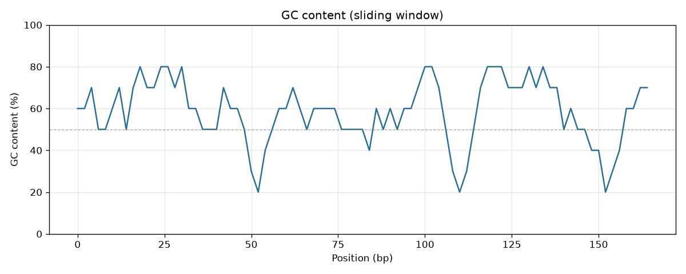

# GenomeSketch

**DNA sequence analysis toolkit for motifs, ORFs, mutations, and alignment.**

GenomeSketch is a lightweight, fully offline bioinformatics toolkit that parses
FASTA files and analyzes DNA sequences through nucleotide statistics, motif
search, reverse complements, transcription, translation, open reading frame
detection, mutation comparison, repeat detection, global sequence alignment,
and GC-content visualization.

Every algorithm is implemented from scratch — no network access, no cloud
services, no database, and **no Biopython dependency for core features**. It is
designed to read like a clean educational/research utility rather than a black
box.

**Stack:** Python, NumPy, Pandas, Matplotlib, Pytest, argparse (Typer-style
CLI), custom FASTA parser, Needleman-Wunsch alignment.

---

## Overview

A lightweight bioinformatics tool that parses FASTA files and analyzes DNA
sequences through GC-content statistics, motif search, reverse complements,
transcription, translation, open reading frame detection, mutation comparison,
repeat detection, and global sequence alignment.

Run the CLI on DNA sequence files to calculate nucleotide statistics, search
motifs, compare mutations, detect coding regions, align sequences, and generate
visualizations such as GC-content plots and ORF maps.

---

## Installation

GenomeSketch requires **Python 3.11+**.

```bash
# 1. Clone
git clone https://github.com/kingsleychenlab/GenomeSketch.git
cd GenomeSketch

# 2. (Recommended) create a virtual environment
python3 -m venv .venv
source .venv/bin/activate        # Windows: .venv\Scripts\activate

# 3. Install dependencies
pip install -r requirements.txt

# 4. (Optional) install the package so the `genomesketch` command is on PATH
pip install -e .
```

After `pip install -e .` you can call the tool as `genomesketch <command>`.
Without installing, use the module form `python -m genomesketch.cli <command>`.
Both are equivalent; the examples below use the module form.

---

## CLI usage

```text
genomesketch stats       <file>                          Nucleotide composition statistics
genomesketch motif       <file> --motif ATG [--revcomp]  Exact motif search (overlapping)
genomesketch revcomp     <file>                          Reverse complement
genomesketch transcribe  <file>                          Transcribe DNA -> RNA
genomesketch translate   <file> --frame 1                Translate to protein (frames 1..3, -1..-3)
genomesketch orfs        <file> [--min-length N] [--longest]   Find ORFs in all 6 frames
genomesketch compare     <ref> <mut> [--align]           Mutation comparison
genomesketch align       <ref> <mut> [--local]           Pairwise alignment (NW / SW)
genomesketch repeats     <file> --k 3 --min-count 3 [--tandem]  Repeat detection
genomesketch kmers       <file> --k 3 [--top 20]         k-mer frequency table
genomesketch plot-gc     <file> --window 100 --step 10 -o gc.png       GC sliding-window plot
genomesketch plot-bases  <file> -o bases.png             Nucleotide frequency bar chart
genomesketch plot-orfs   <file> -o orf_map.png           ORF map
genomesketch plot-motif  <file> --motif ATG -o motif.png Motif position map
```

Add `--iupac` to any command to allow full IUPAC ambiguity codes (the MVP
alphabet is `A, T, C, G, N`). Run `genomesketch --help` or
`genomesketch <command> --help` for details.

---

## Examples

All commands below are runnable against the bundled `examples/` files.

### Statistics

```bash
python -m genomesketch.cli stats examples/sample.fasta
```

```text
Sequence: sample_1
Length: 174 bp
A: 37
T: 35
C: 43
G: 59
N: 0
GC content: 58.62%
AT content: 41.38%
GC skew: 0.157
AT skew: 0.028
```

### Motif search (overlapping, optional reverse complement)

```bash
python -m genomesketch.cli motif examples/sample.fasta --motif ATG
```

```text
Sequence: sample_1
Motif: ATG  (matches: 6)
  pos 7-10  strand +  ATG
  pos 22-25  strand +  ATG
  pos 52-55  strand +  ATG
  pos 73-76  strand +  ATG
  pos 127-130  strand +  ATG
  pos 153-156  strand +  ATG
```

Add `--revcomp` to also report reverse-complement hits (reported on the `-`
strand).

### Reverse complement

```bash
python -m genomesketch.cli revcomp examples/sample.fasta
```

`ATGCCG` becomes `CGGCAT` (`A<->T`, `C<->G`, `N->N`, then reversed).

### Transcription

```bash
python -m genomesketch.cli transcribe examples/sample.fasta
```

`ATGCGT` becomes `AUGCGU` (`T -> U`).

### Translation

```bash
python -m genomesketch.cli translate examples/sample.fasta --frame 1
```

`ATGGAATTTTAA` translates to `MEF*`. Frames `1, 2, 3` read the forward strand;
`-1, -2, -3` read the reverse complement. Incomplete trailing codons are
ignored, `*` marks a stop, and `X` marks any codon containing `N`.

### ORF finder

```bash
python -m genomesketch.cli orfs examples/sample.fasta --min-length 30
```

```text
Sequence: sample_1  (ORFs found: 3)

ORF 1
Frame: +2
Start: 7
Stop: 43
Length: 36 bp
Protein: MTVSGMGLVRS

ORF 2
Frame: -1
Start: 96
Stop: 129
Length: 33 bp
Protein: MRALYIARAS

ORF 3
Frame: +2
Start: 127
Stop: 157
Length: 30 bp
Protein: MGWCAAAKA
```

### Mutation comparison

```bash
python -m genomesketch.cli compare examples/reference.fasta examples/mutated.fasta
```

```text
Reference: reference (60 bp)
Mutated:   mutated (60 bp)
Mode: equal-length
Percent identity: 96.7%
Substitutions: 2
  Substitution at position 11: T -> A
  Substitution at position 36: T -> G
```

Pass `--align` (or compare sequences of unequal length) to switch to
alignment-based comparison, which additionally reports insertions and
deletions.

### Global alignment (Needleman-Wunsch)

```bash
python -m genomesketch.cli align examples/reference.fasta examples/mutated.fasta
```

```text
Algorithm: Needleman-Wunsch (global)
Score: 56
Identity: 96.7%
Matches: 58  Mismatches: 2  Gaps: 0

reference  ATGCGTACCGTTAGCTAGCTAGGCTAAGGCATGAAATTTGGGCCCTAAGGCACCTGTAGC
           |||||||||||.||||||||||||||||||||||||.|||||||||||||||||||||||
mutated    ATGCGTACCGTAAGCTAGCTAGGCTAAGGCATGAAAGTTGGGCCCTAAGGCACCTGTAGC
```

Add `--local` for Smith-Waterman local alignment.

### Repeat detection

```bash
python -m genomesketch.cli repeats examples/sample.fasta --k 3 --min-count 3
```

Reports every k-mer occurring at least `--min-count` times, its copy count, the
spanned region (`start-end`), and all start positions. Use `--tandem` to report
only immediately-adjacent (tandem) repeats such as `ATGATGATG`.

### Visualizations

```bash
python -m genomesketch.cli plot-gc    examples/sample.fasta --window 10 --step 2 -o gc.png
python -m genomesketch.cli plot-bases examples/sample.fasta -o bases.png
python -m genomesketch.cli plot-orfs  examples/sample.fasta --min-length 30 -o orf_map.png
python -m genomesketch.cli plot-motif examples/sample.fasta --motif ATG --revcomp -o motif.png
```

Pre-rendered example plots live in [`examples/plots/`](examples/plots/).



---

## Algorithm explanations

### FASTA parsing
A hand-written parser reads lines, treating any line beginning with `>` as a
header (`id` = first token, `description` = the rest). Sequence lines are
concatenated with whitespace and blank lines ignored. Multiple records per file
are supported; a headerless body is returned as a single `sequence_1` record.

### Statistics and formulas
For each sequence GenomeSketch reports length, per-base counts (A/T/C/G/N), and:

```
GC content = (G + C) / (A + T + G + C)
AT content = (A + T) / (A + T + G + C)
GC skew    = (G - C) / (G + C)
AT skew    = (A - T) / (A + T)
```

All divisions are guarded so that empty or all-`N` sequences return `0.0`
instead of raising. `N` is excluded from the GC/AT content denominator.

### Motif search
Exact search scans left to right, advancing by **one** position after each hit
so that overlapping matches are found (`AAA` in `AAAAA` -> positions `0, 1, 2`).
With `--revcomp` the reverse complement of the motif is also searched on the
forward strand and reported on the `-` strand.

### Reverse complement & transcription
Complement mapping `A<->T`, `C<->G`, `N->N` (plus IUPAC pairs), then reversed.
Transcription replaces `T` with `U`.

### Translation
Uses a manually written **NCBI standard genetic code** (table 1). Frames `1/2/3`
read the forward strand at offset `0/1/2`; `-1/-2/-3` read the reverse
complement. Stop codons map to `*`; codons containing unknown bases map to `X`;
incomplete trailing codons are ignored.

### ORF finding
Scans all six reading frames. Within a frame, an ORF runs from the first `ATG`
to the next in-frame stop codon (`TAA`, `TAG`, `TGA`), after which scanning
resumes. Reverse-strand ORFs are detected on the reverse complement and mapped
back to forward-strand coordinates. Supports `--min-length` and `--longest`.

### Mutation comparison
Equal-length sequences are compared base-by-base (substitutions + percent
identity). Unequal-length (or `--align`) comparisons first run Needleman-Wunsch
and then classify each column as match, substitution, insertion, or deletion.

### Needleman-Wunsch global alignment
Full dynamic-programming implementation. Default scoring: **match +1,
mismatch -1, gap -2**. A scoring matrix and a traceback matrix are built
explicitly; the traceback reconstructs the two aligned strings, the score, the
percent identity, and a match/mismatch/gap map. Smith-Waterman local alignment
is available via `align --local`.

### Repeat detection
Builds an index of every length-`k` substring and its positions, then reports
k-mers meeting the `--min-count` threshold. Tandem detection finds maximal runs
of a k-mer repeated with stride `k`.

---

## Coordinate convention

Internally GenomeSketch uses **0-based, half-open** intervals `[start, stop)`.
For an ORF this means `start` is the index of the first base of the start codon,
`stop` is one position past the last base of the stop codon, and
`length = stop - start` (which includes the stop codon). All CLI position output
follows this 0-based convention.

---

## Testing

```bash
python -m pytest
```

The suite (94 tests) covers FASTA parsing, multi-sequence parsing, invalid
nucleotide handling, GC content and skew, reverse complement, transcription,
translation and reading frames, overlapping and reverse-complement motif
search, ORF finding, equal-length mutation comparison, Needleman-Wunsch score
and traceback, repeat detection, plot-generation smoke tests, and CLI smoke
tests.

---

## Project structure

```
GenomeSketch/
  genomesketch/
    __init__.py
    cli.py            # argparse command-line interface
    io.py             # custom FASTA / plain-text parser
    validation.py     # alphabet validation & normalisation
    stats.py          # nucleotide composition & GC windows
    motifs.py         # exact / overlapping / revcomp motif search
    transform.py      # complement, reverse complement, transcription
    translate.py      # standard genetic code translation
    orfs.py           # six-frame ORF detection
    mutations.py      # substitution & indel comparison
    alignment.py      # Needleman-Wunsch & Smith-Waterman
    repeats.py        # k-mer & tandem repeat detection
    visualization.py  # Matplotlib plots
    export.py         # CSV / JSON export helpers
  tests/              # pytest suite
  examples/           # sample.fasta, reference.fasta, mutated.fasta, multi_sequence.fasta
    plots/            # pre-rendered example figures
  README.md
  LICENSE
  pyproject.toml
  requirements.txt
```

---

## Limitations

- MVP alphabet is `A, T, C, G, N`; other IUPAC codes require `--iupac`.
- Translation uses the standard genetic code only (NCBI table 1).
- Alignment is quadratic in time and memory — best for short-to-moderate
  sequences, not whole genomes.
- ORF detection reports the first-`ATG`-to-stop ORF per stop codon, not every
  nested start.
- No FASTQ / quality-score support yet.

---

## Future work

- Smith-Waterman is included; affine gap penalties are a natural next step.
- k-mer frequency vectorization and CpG-island detection.
- Codon-usage bias and protein molecular-weight estimates.
- Batch FASTA processing with CSV/JSON export.
- Full IUPAC ambiguity handling throughout.
- Large-file FASTA indexing (pyfastx-style).
- An optional interactive Streamlit dashboard and annotation-style genome view.

---

## License

Released under the [MIT License](LICENSE).
